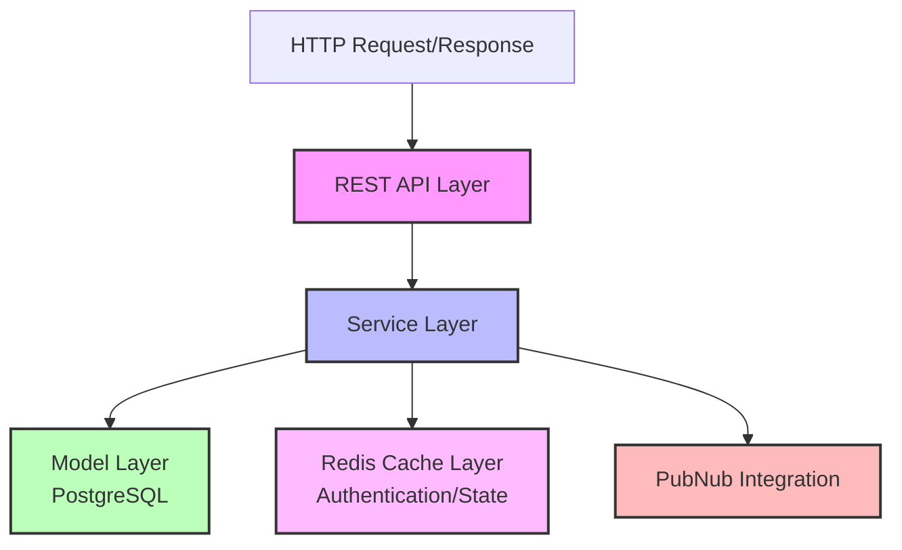
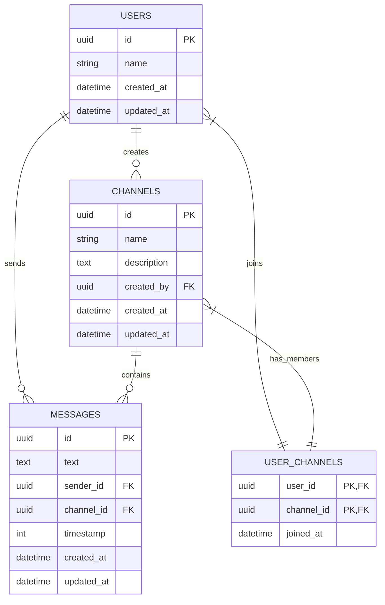
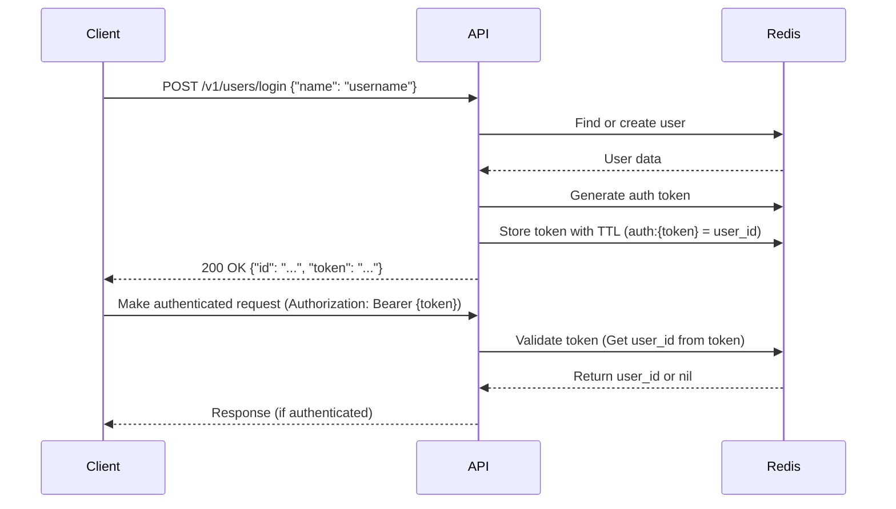
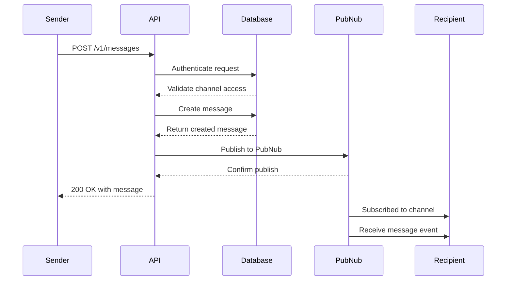
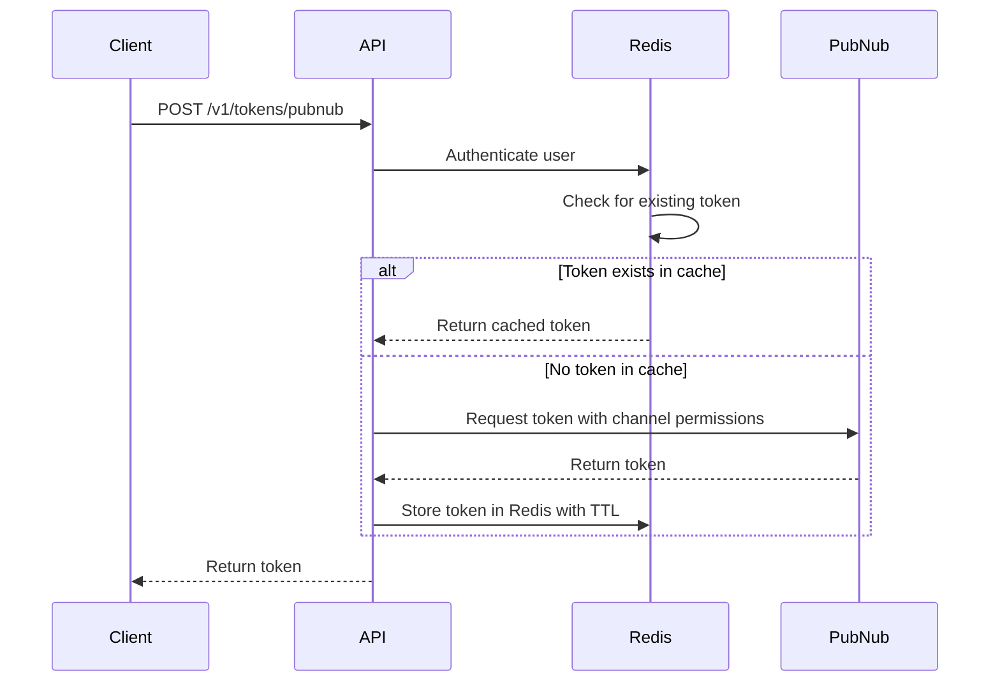
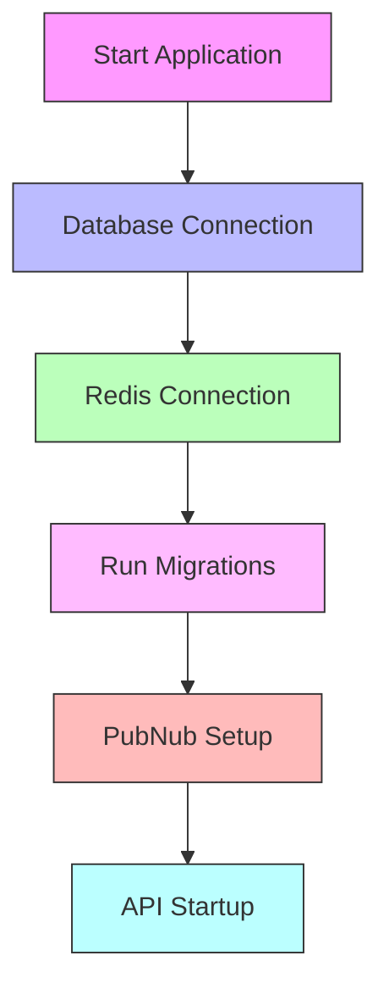

# Documentation

## Overview

This document provides a comprehensive guide to the Chat API, a RESTful service built with Ruby using the Grape framework. The API enables real-time chat functionality through PubNub integration, with support for user management, channel creation, message exchange, and presence tracking.

## Architecture

The Chat API follows a layered architecture with clear separation of concerns:



## Database Schema

The system uses PostgreSQL with the following schema:



## API Endpoints

### Authentication

All authenticated endpoints require a token in the `Authorization` header:

```
Authorization: Bearer <token>
```

### Ping

**Endpoint**: `GET /v1/ping`

**Purpose**: Check if the API is running.

**Response Example**:
```json
{
  "ping": "pong"
}
```

### Users

#### Login

**Endpoint**: `POST /v1/users/login`

**Purpose**: Login or create a user.

**Request Body**:
```json
{
  "name": "username"
}
```

**Response Example**:
```json
{
  "id": "550e8400-e29b-41d4-a716-446655440000",
  "name": "username",
  "created_at": "2024-04-05T12:00:00Z",
  "updated_at": "2024-04-05T12:00:00Z",
  "status": "online",
  "token": "auth-token-string"
}
```

#### Logout

**Endpoint**: `DELETE /v1/users/logout`

**Purpose**: Logout the current user.

**Response Example**:
```json
{
  "success": true,
  "message": "Logged out successfully"
}
```

#### Get Current User Info

**Endpoint**: `GET /v1/users/me`

**Purpose**: Get information about the currently authenticated user.

**Response Example**:
```json
{
  "id": "550e8400-e29b-41d4-a716-446655440000",
  "name": "username",
  "created_at": "2024-04-05T12:00:00Z",
  "updated_at": "2024-04-05T12:00:00Z",
  "status": "online"
}
```

#### Create or Join Channel via User Endpoint

**Endpoint**: `POST /v1/users/channels`

**Purpose**: Create a new channel or join an existing one from the user context.

**Request Body**:
```json
{
  "name": "channel-name"
}
```

**Response Example**:
```json
{
  "id": "550e8400-e29b-41d4-a716-446655440001",
  "name": "channel-name",
  "description": "Channel description",
  "created_by": "550e8400-e29b-41d4-a716-446655440000",
  "created_at": "2024-04-05T12:00:00Z",
  "updated_at": "2024-04-05T12:00:00Z"
}
```

### Channels

#### Create Channel

**Endpoint**: `POST /v1/channels`

**Purpose**: Create a new channel.

**Request Body**:
```json
{
  "name": "channel-name",
  "description": "Channel description"
}
```

**Response Example**:
```json
{
  "id": "550e8400-e29b-41d4-a716-446655440001",
  "name": "channel-name",
  "description": "Channel description",
  "created_by": "550e8400-e29b-41d4-a716-446655440000",
  "created_at": "2024-04-05T12:00:00Z",
  "updated_at": "2024-04-05T12:00:00Z"
}
```

#### Join Channel

**Endpoint**: `POST /v1/channels/:id/join`

**Purpose**: Join an existing channel.

**Response Example**:
```json
{
  "id": "550e8400-e29b-41d4-a716-446655440001",
  "name": "channel-name",
  "description": "Channel description",
  "created_by": "550e8400-e29b-41d4-a716-446655440000",
  "created_at": "2024-04-05T12:00:00Z",
  "updated_at": "2024-04-05T12:00:00Z",
  "joined": true,
  "already_member": false
}
```

#### Get Channel Details

**Endpoint**: `GET /v1/channels/:id`

**Purpose**: Get detailed information about a channel, including members.

**Response Example**:
```json
{
  "id": "550e8400-e29b-41d4-a716-446655440001",
  "name": "channel-name",
  "description": "Channel description",
  "created_by": "550e8400-e29b-41d4-a716-446655440000",
  "created_at": "2024-04-05T12:00:00Z",
  "updated_at": "2024-04-05T12:00:00Z",
  "members": [
    {
      "id": "550e8400-e29b-41d4-a716-446655440000",
      "name": "username",
      "created_at": "2024-04-05T12:00:00Z",
      "updated_at": "2024-04-05T12:00:00Z",
      "status": "online"
    }
  ]
}
```

#### List Channels

**Endpoint**: `GET /v1/channels`

**Purpose**: List all available channels, with a flag indicating if the user has joined.

**Response Example**:
```json
[
  {
    "id": "550e8400-e29b-41d4-a716-446655440001",
    "name": "channel-name",
    "description": "Channel description",
    "created_by": "550e8400-e29b-41d4-a716-446655440000",
    "created_at": "2024-04-05T12:00:00Z",
    "updated_at": "2024-04-05T12:00:00Z",
    "joined": true
  }
]
```

#### Get Channel Message History

**Endpoint**: `GET /v1/channels/:id/history`

**Purpose**: Get message history for a channel with pagination.

**Parameters**:
- `limit` (optional): Number of messages to retrieve (default: 50)

**Response Example**:
```json
[
  {
    "id": "550e8400-e29b-41d4-a716-446655440002",
    "message": "Hello, world!",
    "sender": "username",
    "timestamp": 1617634800,
    "channel": "channel-name",
    "channel_id": "550e8400-e29b-41d4-a716-446655440001"
  }
]
```

#### Get Channel Presence

**Endpoint**: `GET /v1/channels/:id/presence`

**Purpose**: Get presence information for a specific channel.

**Response Example**:
```json
{
  "uuids": ["550e8400-e29b-41d4-a716-446655440000"]
}
```

### Messages

#### Send Message

**Endpoint**: `POST /v1/messages`

**Purpose**: Send a message to a channel.

**Request Body**:
```json
{
  "channel_id": "550e8400-e29b-41d4-a716-446655440001",
  "text": "Hello, world!"
}
```

**Response Example**:
```json
{
  "id": "550e8400-e29b-41d4-a716-446655440002",
  "text": "Hello, world!",
  "sender_id": "550e8400-e29b-41d4-a716-446655440000",
  "channel_id": "550e8400-e29b-41d4-a716-446655440001",
  "created_at": "2024-04-05T12:00:00Z",
  "updated_at": "2024-04-05T12:00:00Z"
}
```

### Tokens

#### Generate PubNub Token

**Endpoint**: `POST /v1/tokens/pubnub`

**Purpose**: Generate a PubNub access token for real-time messaging. When a token is needed, clients should call this endpoint to get a fresh token.

**Response Example**:
```json
{
  "token": "pubnub-token-string"
}
```

## Authentication Flow



## Message Flow



## PubNub Token Generation Flow



## Key Features and Implementation Details

### User Authentication

1. **Token-based Authentication**:
   - Tokens are generated during login and stored in Redis
   - Default TTL is 24 hours
   - Tokens are validated on each API request

2. **Status Tracking**:
   - User online/offline status is stored in Redis
   - Status is updated during login/logout

### Channel Management

1. **Channel Creation**:
   - Channels are created with a name, description, and creator
   - Creator is automatically added as a member

2. **Channel Membership**:
   - Users must join a channel to access its messages
   - Membership is stored in the `user_channels` join table

3. **Access Control**:
   - API endpoints verify channel membership before allowing access
   - PubNub tokens are scoped to only the channels a user is a member of

### Messaging

1. **Message Storage**:
   - Messages are stored in PostgreSQL with sender, channel, text, and timestamp
   - Messages can be retrieved with pagination

2. **Real-time Delivery**:
   - Messages are published to PubNub for real-time delivery
   - Messages include full context (sender, channel, etc.)

### PubNub Integration

1. **Token Generation**:
   - PubNub Access Manager v3 (PAMv3) is used for access control
   - Tokens are granted specific permissions for channels the user has access to
   - Tokens are cached in Redis to improve performance

2. **Event Types**:
   - `new_message` - When a message is sent to a channel

3. **Presence Tracking**:
   - PubNub presence feature tracks who is online in a channel
   - API provides an endpoint to get presence information

## Error Handling

The API uses standard HTTP status codes for errors:

| Status Code | Description |
|-------------|--------------------------------------------|
| 400 | Bad Request - Invalid parameters |
| 401 | Unauthorized - Authentication required |
| 403 | Forbidden - User doesn't have access |
| 404 | Not Found - Resource not found |
| 500 | Internal Server Error |

## Security Considerations

1. **Token Expiration**:
   - All authentication tokens have a 24-hour TTL
   - PubNub tokens are similarly time-limited

2. **Access Control**:
   - Users can only access channels they are members of
   - PubNub tokens are scoped to only those channels

3. **Redis for Token Storage**:
   - Tokens are stored in Redis with automatic expiration
   - Token validation happens on every request

## Initialization Process



The application initialization follows this sequence:

1. **Database Connection**:
   - PostgreSQL connection is established
   - UUID extension is verified

2. **Redis Connection**:
   - Redis client is initialized for token and status storage

3. **Migrations**:
   - Database migrations are run to ensure schema is up to date

4. **PubNub Setup**:
   - PubNub client is initialized with admin credentials

5. **API Startup**:
   - Grape API is mounted and ready to accept requests

## Frontend PubNub Integration Guide

### Initial Token Acquisition

When a frontend application first loads, it should:

1. Authenticate with the API (`/v1/users/login`) to get an API token
2. Request a PubNub token from the `/v1/tokens/pubnub` endpoint
3. Initialize the PubNub client with this token

### Handling Token Expiration

When a PubNub token expires, the client will receive a 403 error from PubNub. To handle this:

1. Catch PubNub API errors in your application
2. When a 403 error occurs, request a new token from `/v1/tokens/pubnub`
3. Update the PubNub client with the new token using the `setToken()` method (varies by SDK)
4. Retry the failed operation

Example code for handling token expiration in JavaScript:

```javascript
// PubNub error handler
pubnub.addListener({
  status: function(statusEvent) {
    if (statusEvent.category === 'PNAccessDeniedCategory') {
      // Token expired or invalid
      refreshPubNubToken().then(() => {
        // Reconnect PubNub with new token
        pubnub.reconnect();
      });
    }
  }
});

async function refreshPubNubToken() {
  try {
    const response = await fetch('/api/v1/tokens/pubnub', {
      method: 'POST',
      headers: {
        'Authorization': `Bearer ${apiToken}`
      }
    });
    
    if (response.ok) {
      const data = await response.json();
      // Update PubNub with new token
      pubnub.setToken(data.token);
      return true;
    }
    return false;
  } catch (error) {
    console.error('Failed to refresh PubNub token:', error);
    return false;
  }
}
```

### Managing Channel Permissions

When a user creates or joins a channel, the server automatically updates their PubNub token permissions. However, the client still needs to:

1. Request a new token after joining or creating a channel to get the updated permissions
2. Update the PubNub client with the new token

To handle this in your frontend:

```javascript
async function joinChannel(channelId) {
  try {
    // Join the channel through API
    const joinResponse = await fetch(`/api/v1/channels/${channelId}/join`, {
      method: 'POST',
      headers: {
        'Authorization': `Bearer ${apiToken}`
      }
    });
    
    if (joinResponse.ok) {
      // Get a fresh token with updated permissions
      await refreshPubNubToken();
      
      // Subscribe to the channel with the new token
      pubnub.subscribe({
        channels: [channelId]
      });
      
      return true;
    }
    return false;
  } catch (error) {
    console.error('Failed to join channel:', error);
    return false;
  }
}
```

For more information, refer to the [PubNub Access Manager Documentation](https://www.pubnub.com/docs/general/security/access-control). 